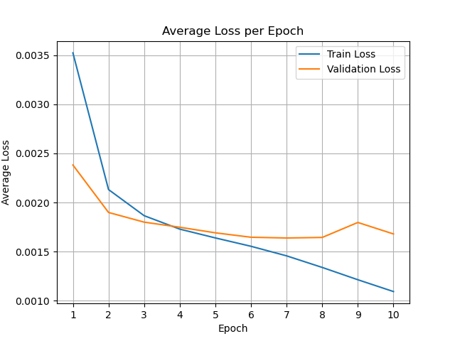
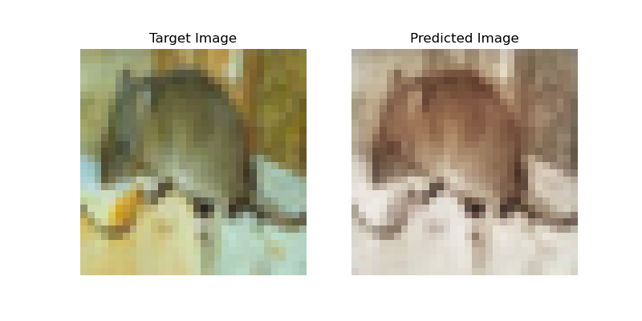
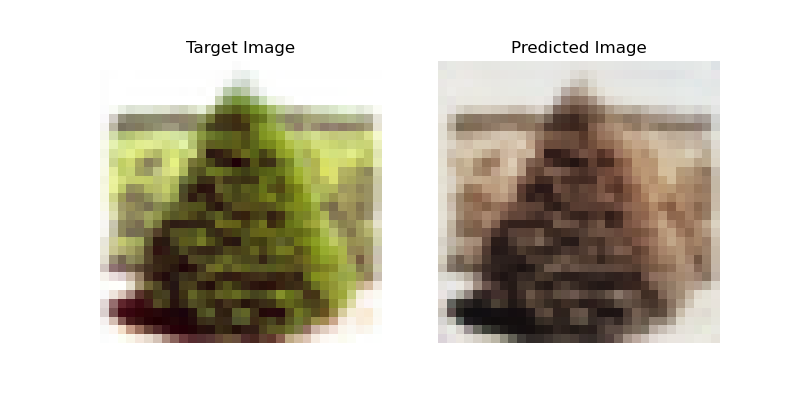
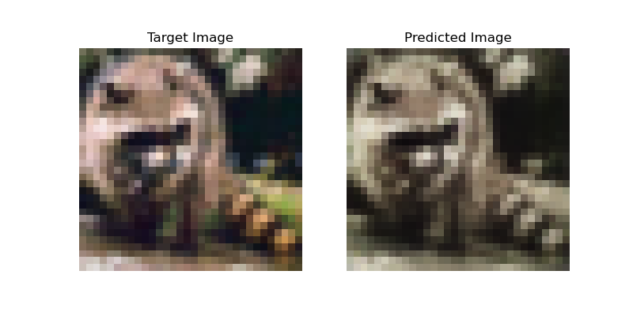

# Image Colorizer

## Table of Contents

- [Introduction](#introduction)
- [Method](#method)
- [Results](#results)
- [Discussion/Conclusion](#discussionconclusion)

## Introduction

This is a project to test whether the **U-Net** convolutional neural network can be used to colarize black and white pictures. The network is trained using the images from the **CIFAR-100** dataset.

## Method

The model is constructed like a regular U-Net architecure with input dimension $32 \times 32 \times 1$ and output dimension $32 \times 32 \times 3$, i.e. the outout has more channels than the input. This basically means that the output needs to learn to extract extra information. Down bellow is an example of the network architecture with similar dimensions.

The model is trained using the **mean squared error**

$$
\mathcal{L}_\text{MSE} = \frac{1}{n}\sum_{i=1}^{n}\left(y_i - \hat{y}_i\right)^2
$$

between the regular image as the target and a corresponding black and white image feeded into the network as the prediction, $\hat{y}_i = f_\theta\left(x_i\right)$. After each epoch the average validation loss is computed to evaluate the model over time.

The final model is evaluated by plotting targets and predictions side by side and comparing similarity.

## Results

The training yielded the following loss over ten epochs:

Here follow three random test samples, first the target image and then the predicted image:

## Discussion/Conclusion

It is clear that the image colorizer does not work as intended. There are several issues here, first off the the ambiguity of the task: Given a gray scale image of a shirt, it is very hard to tell if that shirt should be for example red or blue. This makes supervision hard, and as seen in the results we end up predicting an average with desaturated colors. Another issue if that the U-Net architecture perserves structure, but not semantics. For colorization the semantic understanding is more important that the structural. The model would need to recognize that something is e.g. grass or a sky to color it meanifully, rather than e.g. corners and edges.

However even though the colorization in itself did not work very well, this idea can still be used. The encoder part of the U-Net will after training have learned to represent the image in a useful way. This can be used in **transfer learning**, where we after training for colorization, swap out the decoder for a different downstream task. What makes this very efficient is that in the training we use unlabelled images through **self-supervised learning**, thus we can use a lot of images without having to annotate them. This is known as a **pretext task**.

To summarize: Even though using a regular U-Net architecture for image colorization does not work very well, we can use this as a pretext task to learn useful representations from large unlabeled image datasets to use in a different downstream task.
